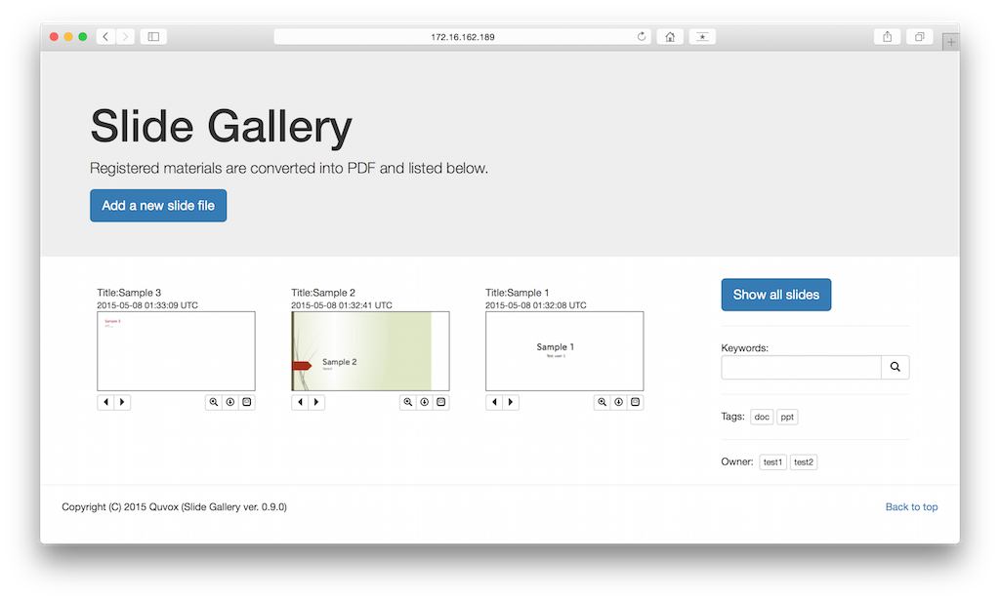
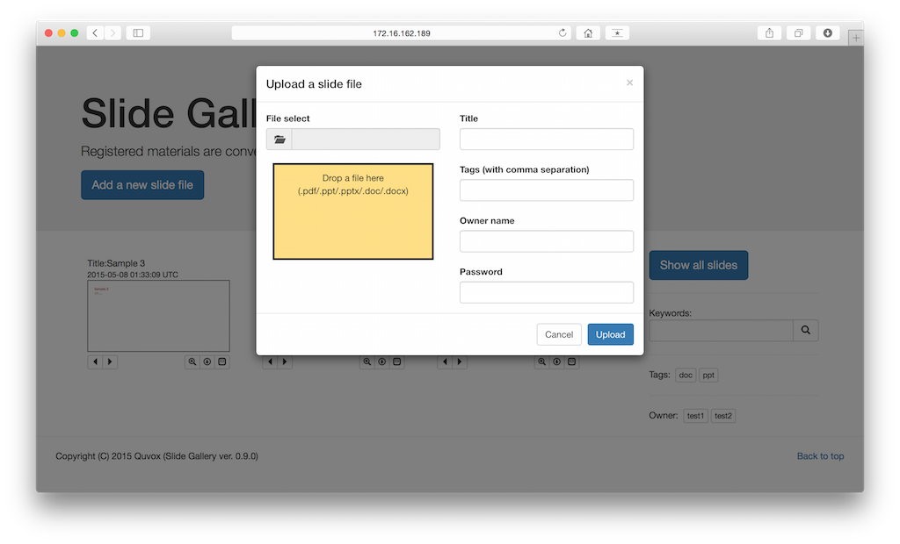
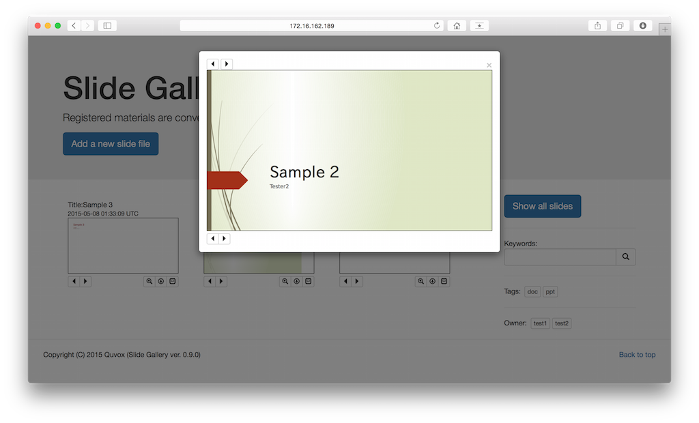
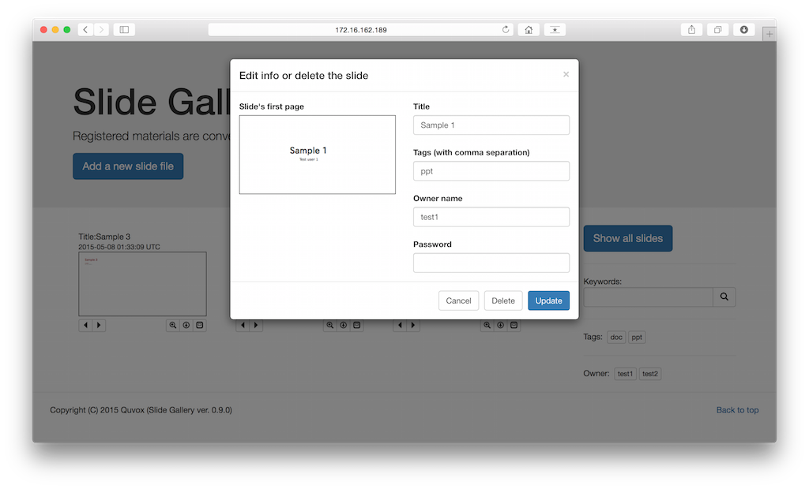

Slide Gallery
====

## Overview
Slide Gallery is a showcase of presentation files.

## Description
Slide Gallery has the following features:

* The thumbnails of the registered files are listed in a main page  
 and you can page through each of them.
* You can see an enlarged slide by selecting the thumbnail.
* Support many kinds of files, such as pdf, ppt, pptx, doc, docx.  
 Internally, all registered files are converted into PDF using [LibreOffice](https://www.libreoffice.org)  
 for thumbnails. So, the types of file you can register [depend on LibreOffice](http://linuxconfig.org/how-to-convert-documents-between-libreoffice-and-microsoft-office-file-formats-on-linux).
* Slide Gallery provides searching by tags, owners and keywords.
* Registered files themselves can be downloaded from the main page.

## Demo and Usage
* The main page is like this.  


* You can upload many types of file and set a title, an owner name and tags for searching.  


* You can see the slide show.  


* You can edit the info of each slide.  


#### Directories for files
The registered files are "public/" directory in the app root.

* *public/orig/* contains the original files. (each file name is changed to just a number.)
* *public/pdf/* contains the converted pdf files for the slide show.
* By accessing "http://host/somewhere/slide/gallery/export",  
  you can get all the registered files with their original file names.

## VS.
Slide Gallery is inspired from [Slide Share](http://www.slideshare.net).  
This app is intended for an internal use, such as company, university and home.

## Requirement
Slide Gallery is a Rails app and internally uses LibreOffice and pdftotext.
* Ruby, Ruby on Rails
* MySQL (for Full-Text search)
* LibreOffice (for converting materials to PDF)
* pdftotext (for extracting text from PDF)

Slide Gallery also uses the following external projects (already included in this repo).
* pdf.js
* Bootstrap
* Ladda for Bootstrap 3

## Install
1. Install ruby, rails and mysql-server in advance
2. Start mysql-server
3. Install some fonts, LibreOffice and pdftotext  
```
# sudo apt-get install fonts-ipafont-gothic fonts-ipafont-mincho
# sudo apt-get install libreoffice
# sudo apt-get install poppler-utils   (for pdftotext)
```

4. In the case of using Apache [*] as a web server, run the script  
   to change ownership of the apache home directory (the script assumes ubuntu distribution.)  
```
# inst/chowner.sh
```

5. Edit config/database.yml based on your environment
6. Set up databases and assets of Slide Gallery. Run the following utility script  
```
# inst/setup.sh     (in the case of running in development mode)  
# inst/setup.sh -p  (in the case of running in production mode)
```

7. Run the server  
```
# setenv SECRET_KEY_BASE `bundle exec rake secret RAILS_ENV=production`
# setenv RAILS_SERVE_STATIC_FILES true
# bundle exec rails s -b 0.0.0.0 -e production   (WebRick in production mode) 
```

8. Access http://localhost:3000/slide/gallery/index

9. Enjoy!


[*] LibreOffice requires to create some files and a directory in the home directory.  
&nbsp;&nbsp;&nbsp; Running LibreOffice by changing HOME environment parameter did not succeed somehow.  
&nbsp;&nbsp;&nbsp; So, this ownership change is just a work around.

#### Apache + Passenger for the web server
In the case of using Apache + Passenger as the web server,  
the sample config of the site is shown [here](doc/apache-site.conf).  
You shoud take care of the following points:

* The root directory of the app must be accessible to www-data (apache).  

* Alias must be the public directory in the app.  
`Alias /slide /var/www/rails/SlideGallery/public`

* PassengerAppRoot must be the root directory of the app.  
`PassengerAppRoot /var/www/rails/SlideGallery`

* Directory directive must be the public directory in the app.  
`<Directory /var/www/rails/SlideGallery/public>`

* A secret key can be generated by the following command  
`# bundle exec rake secret RAILS_ENV=production`

## Contribution
Slide Gallery is open source and contributions from the community are encouraged!  
For the best chance of having your changes merged, please:

1. [Fork](https://github.com/quvox/SlideGallery/fork) the project
2. Create your feature branch (git checkout -b my-new-feature)
3. Commit your changes (git commit -am 'Add some feature')
4. Push to the branch (git push origin my-new-feature)
5. Create new [Pull Request](https://github.com/quvox/SlideGallery/pulls)

I'm a newcomer to an open source community,  
so I'd be happy if I can take any comments and suggestions.

## Licence

[MIT](LICENCE)

## Author

[quvox](https://github.com/quvox)
